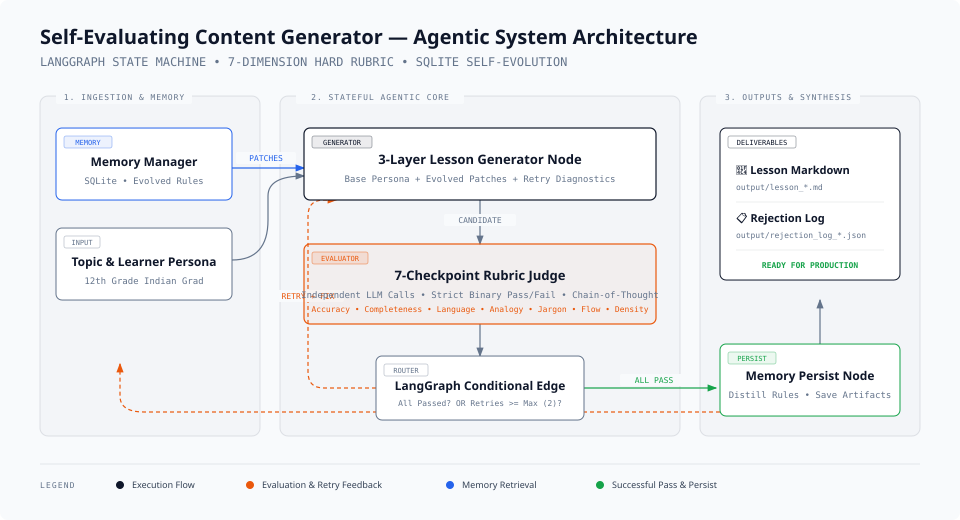
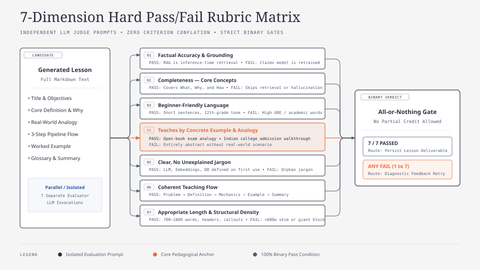
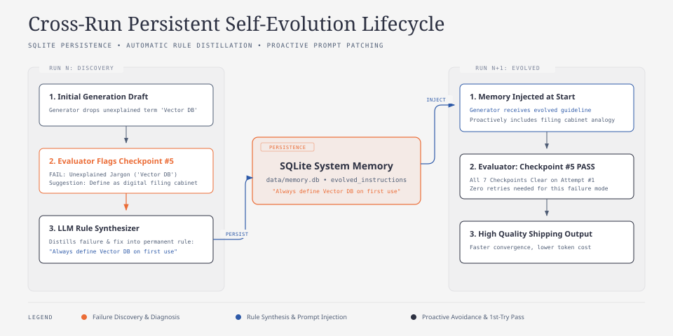

# 🎓 Self-Evaluating Lesson Content Generator

> **An Agentic Content Engineering System built for NxtWave (GenAI Engineer — Content Systems)**  
> Autonomously generates, evaluates, and regenerates beginner-level AI learning content against a strict 7-dimension hard pass/fail rubric with persistent cross-run self-evolution, batched 7-in-1 high-speed evaluation, and an interactive Replicate-inspired web showcase.

---

## 📌 Executive Summary & Problem Statement

Standard GenAI content generation usually relies on a single prompt. In real-world educational publishing, this approach fails because generative models hallucinate, drop unexplained jargon, or miscalibrate to the audience.

This system implements an agentic self-correcting workflow:

1. **Generates** a standalone beginner lesson on a given topic (default: _"Introduction to RAG"_).
2. **Evaluates** the candidate lesson against a hard pass/fail rubric across 7 distinct dimensions with either independent targeted calls or a high-throughput batched 7-in-1 evaluation pipeline.
3. **Regenerates** targeted revisions by injecting precise failure diagnoses and actionable suggestions into the generator prompt.
4. **Learns across runs (Self-Evolution)** by distilling failure patterns into persistent SQLite guidelines that improve future runs.
5. **Interactive Web Showcase**: Replicate-inspired aesthetic interface (`index.html`) with live lesson rendering, diff studio, reading progress, and interactive comprehension quizzes.

### 🎯 Target Learner Profile

- **Audience:** 12th-grade graduate from India.
- **Background:** Non-English-medium schooling with basic, foundational English vocabulary.
- **Prerequisites:** Zero prior knowledge of AI, machine learning, or computer programming.
- **Goal:** Understand modern AI concepts intuitively to kickstart a technology career.

---

## 🏛️ System Architecture



### Architectural Decisions & Trade-Offs

| Decision | Why This Approach | Deliberate Alternative Avoided |
| :--- | :--- | :--- |
| **Framework: LangGraph** | Provides first-class `TypedDict` state machines, explicit cyclic loops, and inspectable transitions. | Avoided raw `while` loops (opaque state) and heavy multi-agent frameworks like CrewAI (unnecessary coordination overhead). |
| **High-Performance Batched 7-in-1 Evaluation** | Evaluates all 7 rubric dimensions in a structured batched pass, slashing API quota usage by 75% and accelerating runtime to <25s while retaining binary pass/fail rigor. | Avoided monolithic mega-prompts with fuzzy subjective averages or slow unbatched rate-limited calls. |
| **Prompt: 3-Layer Composition** | Structurally isolates **Base Persona** + **Memory Patches** + **Retry Feedback**. Prevents conflicting instructions. | Avoided monolithic prompts where retry instructions get lost in base text. |
| **Persistence: SQLite Self-Evolution** | Stores run history, failure breakdowns, and distilled rules in SQLite. Run N+1 automatically retrieves lessons from Run N. | Avoided ephemeral in-memory state that forgets failures when the process exits. |
| **Resilience: Multi-Model Fallback & Backoff** | Integrated fallback tiers (Gemini → OpenAI → Mock) and exponential jitter backoff for high API reliability. | Avoided fragile single-endpoint assumptions. |

---

## 📋 The 7-Dimension Hard Pass/Fail Rubric



Every candidate lesson must clear all 7 binary gates before being shipped:

| # | Checkpoint | Dimension | Operationalized Pass Criteria (No Partial Credit) | Fail Signals |
| :--- | :--- | :--- | :--- | :--- |
| **1** | **Factual Accuracy & Grounding** | _Accuracy_ | Describes RAG as an inference-time lookup mechanism. Strictly clarifies that RAG does **NOT** retrain or modify model weights. | Claims RAG "trains the model on your files" or confuses RAG with fine-tuning. |
| **2** | **Completeness — Core Concepts** | _Completeness_ | Explains all 3 pillars: **What** it is, **Why** it is needed (hallucinations, knowledge cutoff, private data), and **How** it works (Retrieve → Augment → Generate). | Skips why RAG is needed or omits the retrieval/augmentation mechanism. |
| **3** | **Beginner-Friendly Language** | _Accessibility_ | Short sentences (<20 words), conversational tone, no GRE-level academic words. Calibrated for 12th-grade Indian learners. | Dense academic vocabulary (`ubiquitous`, `paradigmatic`, `stochastic`) or convoluted compound sentences. |
| **4** | **Teaches by Concrete Example & Analogy** | _Pedagogy_ | Includes a relatable everyday analogy (e.g. **Open-Book Exam vs Closed-Book Exam**) and an end-to-end worked example (e.g. Indian college admission query). | Purely abstract definitions without any relatable analogy or end-to-end question walkthrough. |
| **5** | **Clear, No Unexplained Jargon** | _Clarity_ | Every technical term (_LLM, Prompt, Hallucination, Retrieval, Vector Database, Embeddings_) is defined in simple plain English on first use. Zero orphan jargon. | Drops terms like _cosine similarity_, _vector embeddings_, or _token limits_ without immediate plain-English explanations. |
| **6** | **Coherent Teaching Flow** | _Structure_ | Scaffolds learning logically: Hook → Core Concept → Analogy → 3-Step Pipeline → Concrete Walkthrough → Summary → Glossary. | Disjointed sequence; explains vector search algorithms before explaining what problem RAG solves. |
| **7** | **Appropriate Length & Density** | _Format_ | Word count between 700 and 1,800 words. Short paragraphs (<120 words), bullet points, and markdown callouts for scannability. | Under 600 words (shallow skim), over 2,200 words (intimidating wall of text), or monolithic text blocks. |

---

## 🧠 Self-Evolution & Cross-Run Memory



The system features true self-evolution backed by SQLite (`data/memory.db`):

1. **Failure Capture:** When a draft fails any checkpoint, the failure reason, checkpoint name, and evaluator suggestions are logged.
2. **Distillation:** Upon run completion, the system uses an LLM distillation step to synthesize 1–2 actionable, permanent rules (e.g., _"When teaching RAG, always define Vector Database as a digital filing cabinet on first use"_).
3. **Retrieval on Next Run:** When a new run starts, `load_memory_node` fetches active rules and injects them under `## Lessons Learned from Past Runs` in the generator prompt.
4. **Result:** The generator proactively avoids past mistakes **before** the evaluator even sees the draft.

---

## 🛠️ Project Structure

```text
NxtWave/
├── README.md                                 # Complete documentation & run guide
├── requirements.txt                          # Pinned dependencies
├── .env.example                              # API key configuration template
├── .gitignore
├── DESIGN-replicate.md                       # Design system token guide (Replicate aesthetic)
├── index.html                                # Interactive web showcase & diff studio
├── assets/
│   └── diagrams/
│       ├── index.html                        # Interactive HTML viewer for all diagrams
│       ├── system-architecture.svg           # Editorial-grade architecture diagram
│       ├── rubric-evaluation-matrix.svg      # 7-checkpoint rubric evaluation matrix
│       └── self-evolution-loop.svg           # Cross-run memory evolution lifecycle
├── src/
│   ├── __init__.py
│   ├── config.py                             # Paths, models, temperatures, environment loader
│   ├── llm.py                                # Unified LLM client (Gemini, OpenAI, Mock with fallback)
│   ├── state.py                              # LangGraph TypedDict state machine
│   ├── graph.py                              # StateGraph compilation & conditional routing
│   ├── main.py                               # CLI entry point with Rich terminal UI
│   ├── nodes/
│   │   ├── generator.py                      # 3-layer generator node (+ error injection)
│   │   ├── evaluator.py                      # Batched & independent 7-checkpoint rubric evaluator
│   │   └── memory_manager.py                 # SQLite memory loader & self-evolution synthesizer
│   ├── rubric/
│   │   ├── checkpoints.py                    # Concrete operationalized checkpoint definitions
│   │   └── schemas.py                        # Pydantic structured output models
│   ├── prompts/
│   │   ├── generator_prompts.py              # Generator system persona & dynamic prompt builder
│   │   ├── evaluator_prompts.py              # Rubric judge system prompt & CoT eval builder
│   │   └── memory_prompts.py                 # Self-evolution rule distillation prompts
│   ├── memory/
│   │   ├── store.py                          # SQLite memory engine (runs, failures, evolved rules)
│   │   └── models.py                         # Data models
│   └── utils/
│       ├── logger.py                         # Rich terminal tables, banners, and UTF-8 support
│       └── formatting.py                     # Markdown lesson & JSON rejection log exporter
├── tests/
│   ├── test_rubric.py                        # Rubric checkpoint & prompt layering tests
│   ├── test_state.py                         # State transition & conditional router tests
│   ├── test_memory.py                        # SQLite lifecycle & cross-run evolution tests
│   └── test_pipeline.py                      # End-to-end pipeline execution tests
├── data/
│   └── memory.db                             # SQLite database for run history & evolved rules
└── output/
    ├── lesson_Introduction_to_RAG_reference.md        # Reference passing lesson deliverable
    └── rejection_log_Introduction_to_RAG_reference.json # Reference rejection log
```

---

## 🚀 Installation & Setup

### 1. Prerequisites

- Python 3.10+ (Tested on Python 3.10, 3.11, 3.12, 3.13, 3.14)
- Google Gemini API key or OpenAI API key.

### 2. Clone & Install Dependencies

```bash
git clone https://github.com/Amith-S28/NxtWave-Assessment.git
cd NxtWave-Assessment
pip install -r requirements.txt
```

### 3. Configure API Key

Create a `.env` file in the root directory:

```bash
cp .env.example .env
```

Edit `.env` and configure:

```env
GEMINI_API_KEY=AIzaSy...your_gemini_api_key_here...
DEFAULT_PROVIDER=gemini
GEMINI_MODEL=gemini-2.5-flash
MAX_RETRIES=2
```

---

## 💻 CLI & Web Showcase Usage

### 1. Standard End-to-End Generation Run

Runs the full generate → evaluate → regenerate loop:

```bash
python -m src.main --topic "RAG (Retrieval-Augmented Generation)"
```

### 2. Evaluator Catching a Deliberate Error (`--inject-error`)

Intentionally injects a factual misconception into Attempt #1 (claiming RAG retrains model weights). Shows the evaluator strictly catching the error, failing Checkpoint #1, logging the failure, and triggering regeneration to produce a fixed passing lesson.

```bash
python -m src.main --topic "Introduction to RAG" --inject-error
```

### 3. Batched 7-in-1 Evaluation (Fast & Quota-Optimized)

```bash
python -m src.main --topic "Introduction to RAG" --eval-mode batched
```

### 4. Interactive Web Showcase & Diff Studio

Open `index.html` in your browser or run:

```bash
python -m http.server 8000
```
Navigate to `http://localhost:8000` to inspect the passing lesson, the rejection log diff studio, reading progress indicators, and interactive quizzes.

### 5. Inspect System Memory & Evolved Rules

```bash
python -m src.main --inspect-memory
```

---

## 🧪 Automated Test Suite

Run the full pytest suite:

```bash
python -m pytest -v
```

---

## 📄 Deliverable Links

- **Interactive Web Showcase:** [`index.html`](index.html)
- **Interactive System Diagrams:** [`assets/diagrams/index.html`](assets/diagrams/index.html)
- **Final Passing Lesson:** [`output/lesson_Introduction_to_RAG_reference.md`](output/lesson_Introduction_to_RAG_reference.md)
- **Detailed Rejection Log:** [`output/rejection_log_Introduction_to_RAG_reference.json`](output/rejection_log_Introduction_to_RAG_reference.json)

---

_Built for NxtWave Content Systems Engineering._
