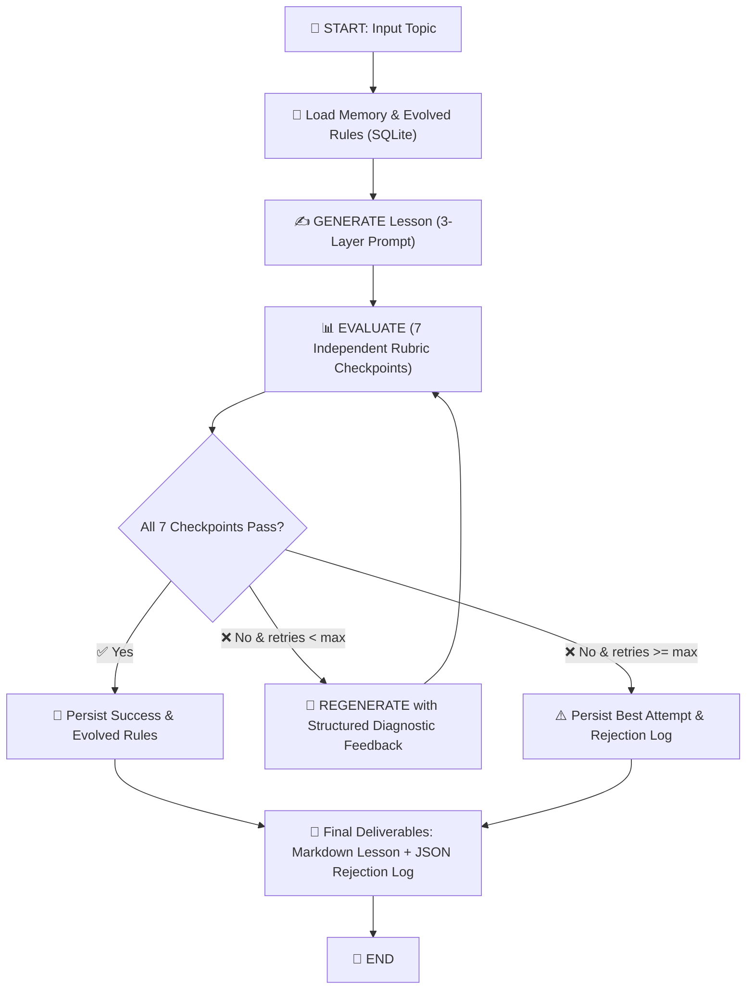

# 🎓 Self-Evaluating Lesson Content Generator

> **An Agentic Content Engineering System built for NxtWave (GenAI Engineer — Content Systems)**  
> Autonomously generates, evaluates, and regenerates beginner-level AI learning content against a strict 7-dimension hard pass/fail rubric with persistent cross-run self-evolution.

---

## 📌 Executive Summary & Problem Statement

Standard GenAI content generation usually relies on a single clever prompt. In real-world educational publishing, this approach fails because generative models hallucinate, drop unexplained jargon, or miscalibrate to the audience.

This system implements a **self-evaluating agentic loop**:
1. **Generates** a standalone beginner lesson on a given topic (default: *"Introduction to RAG"*).
2. **Evaluates** the candidate lesson against a hard pass/fail rubric across 7 distinct dimensions using independent evaluation calls.
3. **Regenerates** targeted revisions by injecting precise failure diagnoses and actionable suggestions into the generator's prompt.
4. **Learns across runs (Self-Evolution)** by distilling failure patterns into persistent SQLite guidelines that improve future runs.

### 🎯 Target Learner Profile
* **Audience:** 12th-grade graduate from India.
* **Background:** Non-English-medium schooling with basic, foundational English vocabulary.
* **Prerequisites:** Zero prior knowledge of AI, machine learning, or computer programming.
* **Goal:** Understand modern AI concepts intuitively to kickstart a technology career.

---

## 🏛️ System Architecture



### Architectural Decisions & Trade-Offs

| Decision | Why This Approach | Deliberate Alternative Avoided |
| :--- | :--- | :--- |
| **Framework: LangGraph** | Provides first-class `TypedDict` state machines, explicit cyclic loops, and inspectable transitions. | Avoided raw `while` loops (opaque state) and heavy multi-agent frameworks like CrewAI (unnecessary coordination overhead). |
| **Evaluation: Independent LLM Calls** | Each of the 7 rubric checkpoints runs in its own focused prompt call. Guarantees zero "criterion conflation" and strict binary grading. | Avoided single mega-prompts that average scores and let subtle jargon errors slide. |
| **Prompt: 3-Layer Composition** | Structurally isolates **Base Persona** + **Memory Patches** + **Retry Feedback**. Prevents conflicting instructions. | Avoided monolithic prompts where retry instructions get lost in base text. |
| **Persistence: SQLite Self-Evolution** | Stores run history, failure breakdowns, and distilled rules in SQLite. Run $N+1$ automatically retrieves lessons from Run $N$. | Avoided ephemeral in-memory state that forgets failures when the process exits. |

---

## 📋 The 7-Dimension Hard Pass/Fail Rubric

Every candidate lesson must clear all 7 binary gates before being shipped:

| # | Checkpoint | Dimension | Operationalized Pass Criteria (No Partial Credit) | Fail Signals |
|---|---|---|---|---|
| **1** | **Factual Accuracy & Grounding** | *Accuracy* | Describes RAG as an inference-time lookup mechanism. Strictly clarifies that RAG does **NOT** retrain or modify model weights. | Claims RAG "trains the model on your files" or confuses RAG with fine-tuning. |
| **2** | **Completeness — Core Concepts** | *Completeness* | Explains all 3 pillars: **What** it is, **Why** it is needed (hallucinations, knowledge cutoff, private data), and **How** it works (Retrieve $\to$ Augment $\to$ Generate). | Skips why RAG is needed or omits the retrieval/augmentation mechanism. |
| **3** | **Beginner-Friendly Language** | *Accessibility* | Short sentences (<20 words), conversational tone, no GRE-level academic words. Calibrated for 12th-grade Indian learners. | Dense academic vocabulary (`ubiquitous`, `paradigmatic`, `stochastic`) or convoluted compound sentences. |
| **4** | **Teaches by Concrete Example & Analogy** | *Pedagogy* | Includes a relatable everyday analogy (e.g. **Open-Book Exam vs Closed-Book Exam**) and an end-to-end worked example (e.g. Indian college admission query). | Purely abstract definitions without any relatable analogy or end-to-end question walkthrough. |
| **5** | **Clear, No Unexplained Jargon** | *Clarity* | Every technical term (*LLM, Prompt, Hallucination, Retrieval, Vector Database, Embeddings*) is defined in simple plain English on first use. Zero orphan jargon. | Drops terms like *cosine similarity*, *vector embeddings*, or *token limits* without immediate plain-English explanations. |
| **6** | **Coherent Teaching Flow** | *Structure* | Scaffolds learning logically: Hook $\to$ Core Concept $\to$ Analogy $\to$ 3-Step Pipeline $\to$ Concrete Walkthrough $\to$ Summary $\to$ Glossary. | Disjointed sequence; explains vector search algorithms before explaining what problem RAG solves. |
| **7** | **Appropriate Length & Density** | *Format* | Word count between 700 and 1,800 words. Short paragraphs (<120 words), bullet points, and markdown callouts for scannability. | Under 600 words (shallow skim), over 2,200 words (intimidating wall of text), or monolithic text blocks. |

---

## 🧠 Self-Evolution & Cross-Run Memory

The system features true self-evolution backed by SQLite (`data/memory.db`):

1. **Failure Capture:** When a draft fails any checkpoint, the failure reason, checkpoint name, and evaluator suggestions are logged.
2. **Distillation:** Upon run completion, the system uses an LLM distillation step to synthesize 1–2 actionable, permanent rules (e.g., *"When teaching RAG, always define Vector Database as a digital filing cabinet on first use"*).
3. **Retrieval on Next Run:** When a new run starts, `load_memory_node` fetches active rules and injects them under `## Lessons Learned from Past Runs` in the generator prompt.
4. **Result:** The generator proactively avoids past mistakes **before** the evaluator even sees the draft.

---

## 🛠️ Project Structure

```
d:\Projects\NxtWave\
├── README.md                                 # Complete documentation & run guide
├── requirements.txt                          # Pinned dependencies
├── .env.example                              # API key configuration template
├── .gitignore
├── src/
│   ├── __init__.py
│   ├── config.py                             # Paths, models, temperatures, environment loader
│   ├── llm.py                                # Unified LLM client (Gemini, OpenAI, Mock)
│   ├── state.py                              # LangGraph TypedDict state machine
│   ├── graph.py                              # StateGraph compilation & conditional routing
│   ├── main.py                               # CLI entry point with Rich terminal UI
│   ├── nodes/
│   │   ├── generator.py                      # 3-layer generator node (+ error injection)
│   │   ├── evaluator.py                      # Independent 7-checkpoint rubric evaluator
│   │   └── memory_manager.py                 # SQLite memory loader & self-evolution synthesizer
│   ├── rubric/
│   │   ├── checkpoints.py                    # Concrete operationalized checkpoint definitions
│   │   └── schemas.py                        # Pydantic structured output models
│   ├── prompts/
│   │   ├── generator_prompts.py              # Generator system persona & dynamic prompt builder
│   │   ├── evaluator_prompts.py              # Rubric judge system prompt & CoT eval builder
│   │   └── memory_prompts.py                 # Self-evolution rule distillation prompts
│   ├── memory/
│   │   ├── store.py                          # SQLite memory engine (runs, failures, evolved rules)
│   │   └── models.py                         # Data models
│   └── utils/
│       ├── logger.py                         # Rich terminal tables, banners, and UTF-8 support
│       └── formatting.py                     # Markdown lesson & JSON rejection log exporter
├── tests/
│   ├── test_rubric.py                        # Rubric checkpoint & prompt layering tests
│   ├── test_state.py                         # State transition & conditional router tests
│   ├── test_memory.py                        # SQLite lifecycle & cross-run evolution tests
│   └── test_pipeline.py                      # End-to-end pipeline execution tests
├── data/
│   └── memory.db                             # SQLite database for run history & evolved rules
└── output/
    ├── lesson_Introduction_to_RAG_reference.md        # Reference passing lesson deliverable
    └── rejection_log_Introduction_to_RAG_reference.json # Reference rejection log
```

---

## 🚀 Installation & Setup

### 1. Prerequisites
* Python 3.10+ (Tested on Python 3.10, 3.11, 3.12, 3.13, 3.14)
* A Google Gemini API key ([Google AI Studio](https://aistudio.google.com/app/apikey)) or OpenAI API key ([OpenAI Platform](https://platform.openai.com/api-keys)).

### 2. Clone & Install Dependencies
```bash
# Clone the repository
git clone https://github.com/your-username/nxtwave-content-generator.git
cd nxtwave-content-generator

# Install dependencies
pip install -r requirements.txt
```

### 3. Configure API Key
Create a `.env` file in the root directory:
```bash
# Copy example template
cp .env.example .env
```
Edit `.env` and paste your API key:
```env
GEMINI_API_KEY=AIzaSy...your_gemini_api_key_here...
DEFAULT_PROVIDER=gemini
GEMINI_MODEL=gemini-2.5-flash
MAX_RETRIES=2
```

---

## 💻 CLI Usage Guide

### 1. Standard End-to-End Generation Run
Runs the full generate $\to$ evaluate $\to$ regenerate loop for "Introduction to RAG":
```bash
python -m src.main --topic "RAG (Retrieval-Augmented Generation)"
```

### 2. Evaluator Catching a Deliberate Error (`--inject-error`)
*Required for Assessment Demo:* Intentionally injects a factual misconception into Attempt #1 (claiming RAG retrains model weights). Shows the evaluator strictly catching the error, failing Checkpoint #1, logging the failure, and triggering regeneration to produce a fixed passing lesson.
```bash
python -m src.main --topic "Introduction to RAG" --inject-error
```

### 3. Inspect System Memory & Evolved Rules
View historical run stats, failure breakdowns, and active prompt guidelines in SQLite:
```bash
python -m src.main --inspect-memory
```

### 4. Clear System Memory
Reset the SQLite memory database:
```bash
python -m src.main --clear-memory
```

### 5. Multi-Provider & Model Options
Run with OpenAI GPT-4o or offline mock mode:
```bash
# OpenAI GPT-4o
python -m src.main --provider openai --model gpt-4o

# Offline Deterministic Mock (Zero API costs / offline testing)
python -m src.main --provider mock
```

---

## 🧪 Automated Test Suite

Run the full pytest suite:
```bash
python -m pytest -v
```

### Test Coverage Highlights:
* **`tests/test_rubric.py`**: Verifies all 7 checkpoints, prompt builders, schema validations, and 3-tier prompt layering.
* **`tests/test_state.py`**: Asserts conditional routing logic (`pass`, `retry`, `max_retries_exceeded`).
* **`tests/test_memory.py`**: Tests SQLite table creation, failure logging, instruction deduplication, and cross-run self-evolution.
* **`tests/test_pipeline.py`**: Runs end-to-end mock pipelines verifying convergence on success and termination on max retries.

---

## 🎥 Loom Video Walkthrough Guide (15–20 Mins)

When recording your video demonstration for the assessment submission, follow this structured outline:

1. **System & Problem Introduction (3 mins)**
   * Show face on camera.
   * Explain the goal: building a production-grade content system that acts as an autonomous editor, not just a one-shot prompt.
   * Highlight the target audience (12th-grade Indian graduate, non-English-medium background).
2. **Architecture Walkthrough (4 mins)**
   * Walk through `src/graph.py` and `src/rubric/checkpoints.py`.
   * Explain why LangGraph stateful cyclic graphs were chosen and why independent evaluator calls prevent criterion conflation.
   * Show the 3-layer generator prompt architecture.
3. **Live Demonstration 1: Deliberate Error Injection (4 mins)**
   * Run: `python -m src.main --topic "Introduction to RAG" --inject-error`
   * Show Attempt #1 failing on *Factual Accuracy & Grounding*.
   * Show the detailed rejection table and structured suggestions.
   * Show Attempt #2 regenerating with targeted feedback and passing all 7 checks.
4. **Live Demonstration 2: Cross-Run Self-Evolution (4 mins)**
   * Run: `python -m src.main --inspect-memory` to show the persisted evolved guidelines.
   * Run a second time and show the terminal displaying *Memory Retrieved: Evolved Guidelines from Past Runs* being injected before generation starts.
5. **Output Review & Google Doc Deliverable (3 mins)**
   * Open `output/lesson_Introduction_to_RAG_reference.md` and show how it incorporates the open-book exam analogy, Indian college cutoff example, zero unexplained jargon, and scannable structure.
   * Show `output/rejection_log_Introduction_to_RAG_reference.json` demonstrating full auditability.

---

## 📄 Deliverable Links
* **Final Passing Lesson:** [`output/lesson_Introduction_to_RAG_reference.md`](output/lesson_Introduction_to_RAG_reference.md)
* **Detailed Rejection Log:** [`output/rejection_log_Introduction_to_RAG_reference.json`](output/rejection_log_Introduction_to_RAG_reference.json)
* **Implementation Plan:** Included in project artifacts.

---

*Built with ❤️ for NxtWave Content Systems Engineering.*
